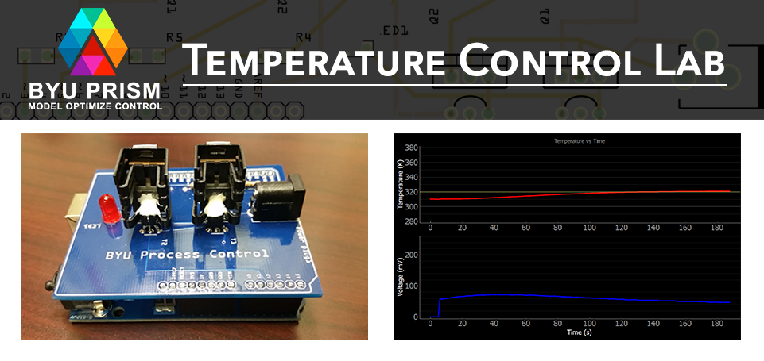

<b>A modular, portable lab for learning <a href="http://apmonitor.com/pdc/index.php">Process Control</a></b>

# Process Control Temperature Lab

The [BYU Arduino Temperature Control Lab](http://apmonitor.com/pdc/index.php/Main/ArduinoTemperatureControl) is designed as a modular, portable, and inexpensive solution for hands-on process control learning.  Heat output is adjusted by modulating the voltage to a transistor. A thermistor measures the temperature. Energy from the transistor output is transferred by conduction and convection to the temperature sensor.  The lab is integrated into a small PCB shield which can be mounted to any [Arduino](https://www.arduino.cc/) or Arduino compatible microcontroller. Experiments can then be programmatically controlled using Python over a USB connection.  

## Key Features
This lab reinforces principles of system dynamics, 
estimation, and model predictive control, including:

* The difference between manual and automatic control
* Step tests to generate dynamic data for empirical modeling
* Dynamic modeling with first principles
* Dynamic data reconciliation
* Tune a moving horizon estimator
* Tune a PID controller
* Tune a model predictive controller
* Combine MHE and MPC

## Getting Started

For instructions on configuring your system and getting started with the lab see [Getting Started](./gettingStarted.md).

## Course Modules

The following example modules are included

#### Step Test

Perform a step test to collect dynamic data.  Steps the input voltage up and down and records output temperatures.

#### Regression

Demonstrates the use of regression in Python to fit first order, second order, and ARX models to collected data.

#### On_Off_Control

Demonstrates control to a desired setpoint using a binary On/Off controller.

#### PID Control

Demonstrates control to a desired setpoint using a Proportional, Integral, Derivative controller.

#### Moving Horizon Estimation

Shows how model parameters can be dynamically estimated during system operation using MHE.

#### Model Predictive Control

Demonstrates advanced control to a desired setpoint using a Model Predictive Controller.

#### MHE and MPC

Combines MHE for online model parameter estimation with advanced MPC control to reach a desired setpoint.

## Course Website

For more information and instructional videos, visit the [Arduino temperature control lab page](http://apmonitor.com/pdc/index.php/Main/ArduinoTemperatureControl) on the BYU Process Dynamics and Control course website.

## Matlab Support

MATLAB must be installed and configured with an add-on package as [shown here for MATLAB 2017b](https://youtu.be/waWgl7-D8GM). This allows MATLAB to connect to the Arduino device with the command *a = arduino*. [MATLAB files](./0_Test_Device/MATLAB) and [Simulink models](./0_Test_Device/Simulink) are available to test the basic functionality of the heaters and sensors.

